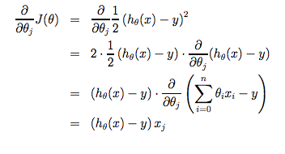

# Gradient Descent For Linear Regression

Note: [At 6:15 "h(x) = -900 - 0.1x" should be "h(x) = 900 - 0.1x"]

When specifically applied to the case of linear regression, a new form of the gradient descent equation can be derived. We can substitute our actual cost function and our actual hypothesis function and modify the equation to :

repeat until convergence: {θ0:=θ1:=}θ0−α1m∑i=1m(hθ(xi)−yi)θ1−α1m∑i=1m((hθ(xi)−yi)xi)
where m is the size of the training set, θ0 a constant that will be changing simultaneously with θ1 and xi,yiare values of the given training set (data).

Note that we have separated out the two cases for θj into separate equations for θ0 and θ1; and that for θ1 we are multiplying xi at the end due to the derivative. The following is a derivation of ∂∂θjJ(θ) for a single example :

The point of all this is that if we start with a guess for our hypothesis and then repeatedly apply these gradient descent equations, our hypothesis will become more and more accurate.

So, this is simply gradient descent on the original cost function J. This method looks at every example in the entire training set on every step, and is called batch gradient descent. Note that, while gradient descent can be susceptible to local minima in general, the optimization problem we have posed here for linear regression has only one global, and no other local, optima; thus gradient descent always converges (assuming the learning rate α is not too large) to the global minimum. Indeed, J is a convex quadratic function. Here is an example of gradient descent as it is run to minimize a quadratic function.

The ellipses shown above are the contours of a quadratic function. Also shown is the trajectory taken by gradient descent, which was initialized at (48,30). The x’s in the figure (joined by straight lines) mark the successive values of θ that gradient descent went through as it converged to its minimum.
