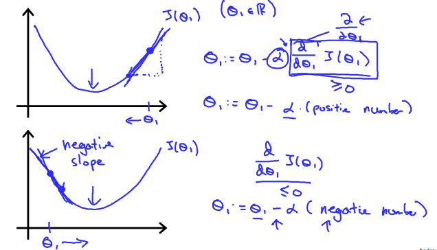

# Gradient Descent Intuition

In this video we explored the scenario where we used one parameter θ1 and plotted its cost function to implement a gradient descent. Our formula for a single parameter was :

Repeat until convergence:

θ1:=θ1−αddθ1J(θ1)
Regardless of the slope's sign for ddθ1J(θ1), θ1 eventually converges to its minimum value. The following graph shows that when the slope is negative, the value of θ1 increases and when it is positive, the value of θ1 decreases.

On a side note, we should adjust our parameter α to ensure that the gradient descent algorithm converges in a reasonable time. Failure to converge or too much time to obtain the minimum value imply that our step size is wrong.

How does gradient descent converge with a fixed step size α?

The intuition behind the convergence is that ddθ1J(θ1) approaches 0 as we approach the bottom of our convex function. At the minimum, the derivative will always be 0 and thus we get:

θ1:=θ1−α∗0

